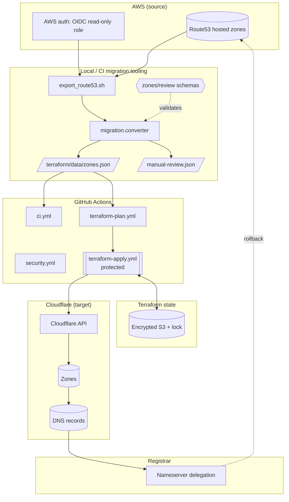
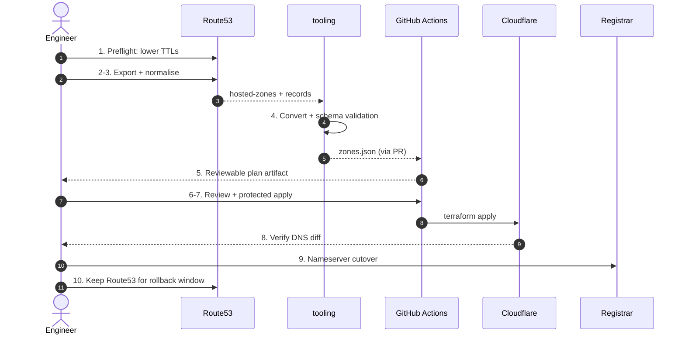

# Architecture

## System purpose

Migrate DNS for multiple domains from **AWS Route53** to **Cloudflare** in a
repeatable, deterministic, auditable, and safe way. The migration is
Infrastructure-as-Code: Route53 is exported to a versioned JSON document that
Terraform turns into Cloudflare zones and DNS records.

## Components

| Component | Path | Responsibility |
| --------- | ---- | -------------- |
| Export script | `scripts/export_route53.sh` | Read-only Route53 dump via AWS CLI, then convert |
| Converter | `migration/converter.py` | Pure, deterministic Route53 → Cloudflare record transform |
| Schema/validation | `schemas/`, `migration/schema.py` | Versioned JSON Schema contract for generated data |
| CLI | `migration/cli.py` | `convert` and `validate` subcommands (no network) |
| Terraform root | `terraform/` | Cloudflare zones + DNS records from `data/zones.json` |
| CI | `.github/workflows/ci.yml` | Lint, type-check, tests, tf fmt/validate/test |
| Plan | `.github/workflows/terraform-plan.yml` | Non-destructive reviewable plan artifact |
| Apply | `.github/workflows/terraform-apply.yml` | Manual, protected production apply |
| Security | `.github/workflows/security.yml` | gitleaks + checkov |
| Export (CI) | `.github/workflows/export.yml` | OIDC read-only Route53 export artifact |

## Current vs improved architecture

**Before:** two divergent implementations; a broken export→apply data contract
(`value` vs `content`); auto-apply to production on push with long-lived AWS
keys; committed credential-shaped tfvars; no tests, schema, or safety guards.

**After:** one canonical pipeline; a schema-validated, deterministic
`zones.json`; a manual-review report so nothing is silently dropped; a guard
against destroying zones from an empty export; least-privilege, manual,
protected production apply; and a full local + CI test suite.

## Trust boundaries and credential flow

* **AWS (source):** touched only by the read-only export step. In CI this uses
  GitHub OIDC to assume a role scoped to `route53:ListHostedZones` and
  `route53:ListResourceRecordSets`. No long-lived AWS keys.
* **Cloudflare (target):** an API token (Zone:Edit, DNS:Edit) supplied via the
  `CLOUDFLARE_API_TOKEN` environment variable read by the provider. It is not a
  Terraform variable, so it never enters the plan file or state — which also
  lets the two-phase plan/apply pipeline authenticate each phase with its own
  token.
* **Terraform state** contains the full zone/record graph and must live in an
  encrypted, locked, access-controlled backend (`terraform/backend.tf.example`).
* Secrets never appear in logs, plans, artifacts, or job summaries.

## Data flow

```
Route53 ──export──▶ hosted-zones.json + records-*.json
        ──convert──▶ zones.json (schema-validated) + manual-review.json
        ──terraform──▶ Cloudflare zones + DNS records
        ──verify──▶ DNS diff ──cutover──▶ registrar nameservers
```

## System architecture diagram

Source: [`docs/diagrams/system-architecture.mmd`](diagrams/system-architecture.mmd)



## Migration sequence diagram

Source: [`docs/diagrams/migration-sequence.mmd`](diagrams/migration-sequence.mmd)



## Rendering the diagrams

The Mermaid source lives under `docs/diagrams/`. To render SVGs (requires
`@mermaid-js/mermaid-cli`):

```bash
npm install -g @mermaid-js/mermaid-cli
make diagram   # writes docs/diagrams/*.svg
```

## Failure modes

| Failure | Detection | Mitigation |
| ------- | --------- | ---------- |
| Incomplete export | `terraform_data.guard` precondition on empty zones | Apply is blocked |
| Unsupported record silently lost | Routed to `manual-review.json` | Human review before cutover |
| Field-contract drift | JSON Schema + `terraform test` | CI fails |
| State corruption | Remote backend + locking | Concurrency + `use_lockfile` |
| Bad cutover | DNS verification + low TTL | Revert nameservers to Route53 |

## Manual-review process

Any record in `manual-review.json` (aliases, routing policies, CAA/SRV,
private zones, unsupported types) must be resolved by an engineer — either
mapped to a Cloudflare equivalent and added to `zones.json`, or explicitly
accepted as out of scope — before nameserver cutover.

## DNS cutover, validation, and rollback

See `docs/MIGRATION_RUNBOOK.md`. In summary: lower TTLs → export → review →
plan → protected apply → verify against Cloudflare nameservers directly →
switch registrar NS → monitor → keep Route53 authoritative for the rollback
window → decommission.

## Extension points

* Add CAA/SRV as first-class Cloudflare `data` blocks (currently review-routed).
* Add a post-apply DNS-diff command comparing Route53 vs Cloudflare answers.
* Multi-environment support via workspaces or per-account `zones.json`.

## Known limitations

* Route53 alias, weighted/latency/failover/geo routing, and health checks have
  no 1:1 Cloudflare equivalent — reported, not auto-migrated.
* CAA and SRV are parsed and reported but not yet emitted as Terraform records.
* DNSSEC must be re-enabled manually in Cloudflare.
* "Zero downtime" depends on the operator following the runbook (low TTLs,
  verification, and keeping Route53 authoritative during rollback).
